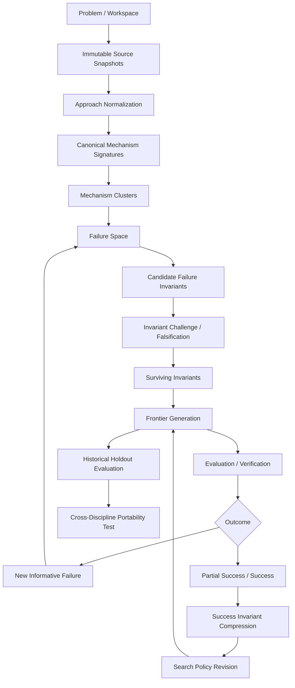

# EPIC: End-to-End Failure-Space Frontier Delivery

GitHub anchor: #10

This document is the delivery spine for `newf`. It charts the path from an empty workspace to a reproducible historical-holdout experiment that tests the central thesis:

> Failure history can be compressed into useful invariants that predict productive search directions better than undirected solution generation.

The product is not organized around `solve`. It is organized around typed transformations over research state.

## Core research loop

```text
failure-space
  -> failure invariant
  -> invariant challenge
  -> invariant break
  -> partial success
  -> success invariant
  -> search-policy mutation
  -> generalized frontier
```

The implementation path is broader because every one of those states must be trustworthy, inspectable, replayable, and comparable.

## End-to-end system flow



The loop is intentionally recursive: useful failures go back into the failure atlas; useful successes mutate the future search policy.

## Delivery principles

These are cross-cutting contracts, not optional refinements:

1. **Source bytes are immutable.** Changed content creates a new snapshot.
2. **Generated interpretation is not source evidence.** Epistemic status never upgrades implicitly.
3. **Models discover candidate structure; software owns identity.** Canonical IDs, fingerprints, and comparison semantics are deterministic.
4. **Mechanistic diversity matters more than surface diversity.** A new wording is not a new research direction.
5. **Abstraction must ground.** Every meaningful abstraction must state what it preserves, loses, and introduces, then survive concrete prediction or round-trip testing.
6. **Failure is a first-class artifact.** A failed proposal is retained when it reduces uncertainty, falsifies an invariant, or changes search policy.
7. **Truth-sensitive operations prefer independent verification.** Model confidence is not proof.
8. **Search policy is persisted state.** Do not rely on the model remembering prior failures from context.
9. **Historical holdout comes before open-problem theater.** The thesis must be falsifiable without solving a famous conjecture.
10. **Portability is the litmus.** The same higher-order operators should survive a domain jump with only adapters/verifiers changing.

## Milestone map

```text
M0  Design contract
M1  Durable research substrate
M2  Comparable mechanism atlas
M3  Explicit failure-space
M4  Failure-invariant loop
M5  Frontier generation + evaluation
M6  Success compression + policy mutation
M7  Historical holdout validation
M8  Cross-discipline portability litmus
```

## Current tracked slices

### M0 — Design contract

**Issue #1 — Design the v0 CLI for failure-space invariant frontier search**

Purpose:

- define CLI semantics;
- define domain boundaries;
- define persistence and provenance contracts;
- define provider roles;
- define historical holdout methodology.

Exit condition:

- later implementation slices can be delivered without redesigning the system mid-flight.

### M1 — Durable research substrate

**Issue #3 — Implement v0 foundation: init, SQLite store, and provenance primitives**

Produces:

```text
Problem
Run
workspace
SQLite migrations
stable IDs
machine-readable output
```

Exit condition:

- research state can be initialized, inspected, and recreated without external services.

**Issue #6 — Implement source ingestion and immutable corpus snapshots**

Produces:

```text
Source
SourceSnapshot
content-addressed object
source lineage
integrity verification
```

Exit condition:

- exact corpus bytes are durable and can be referenced forever by downstream artifacts.

### M2 — Comparable mechanism atlas

**Issue #7 — Implement approach normalization with typed mechanism records**

Produces:

```text
Approach
ApproachRevision
Mechanism
Outcome
FailureBoundary
field-level support/provenance
```

This is the first model-native operator.

The provider may interpret, but all interpretations remain revisioned and source-linked.

Exit condition:

- heterogeneous source descriptions become comparable typed mechanism records without confusing interpretation with truth.

**Issue #9 — Implement deterministic mechanism canonicalization and comparison**

Produces:

```text
canonical vocabulary
versioned MechanismSignature
stable semantic IDs
signature fingerprint
component-wise comparison
ambiguity states
```

Governing rule:

```text
models discover candidate labels
software owns identity
```

Exit condition:

- two approaches can be compared deterministically across assumptions, operators, preserved properties, representations, posture, and failure boundaries.

### M3 — Explicit failure-space

**Issue #11 — Implement mechanism clustering over canonical signatures**

Expected output:

```text
MechanismCluster
cluster membership
representative signature
intra-cluster variation
inter-cluster distance
coverage/diversity report
FailureSpace revision
```

The clustering layer must not hide behind embeddings. Any heuristic used to group mechanisms must remain inspectable and versioned.

Exit condition:

- `newf` can state how many genuinely distinct mechanism families are represented, where coverage is weak, and which failures are redundant.

**Status: delivered (hardened).** `newf cluster build/show/list` groups
signatures into deterministic, profile-driven mechanism families
(coherence-guarded connected components over `canon.CompareWithProfile`, no
embeddings), and `newf failure-space build/show/coverage` materializes the
first-class, versioned failure-space artifact (per-family outcome partition +
coverage + population-level discrimination-loss guard). Review hardening (schema
`v10`): cluster-run identity now includes an `input_set_hash` so re-clustering a
changed signature population produces a new run (the `failure → atlas →
recluster` loop can learn from newly added failures, KTD-1); linkage enforces a
family-coherence invariant so the non-transitive near relation can never
manufacture a family containing a `mechanism-distinct` pair (KTD-2); and a family
spanning multiple member outcomes is reported as `mixed` rather than compressed
to its representative's outcome (KTD-9). Schema `v7`/`v8`/`v10`; see
[`docs/mechanism-clustering.md`](docs/mechanism-clustering.md). This also
delivers the M4.1 FailureSpace slice below. Invariant mining (M4.2) is now
delivered — see its status note below.

## Planned slices

These should become separate delegable issues as preceding contracts stabilize.

### M4.1 — Build the first-class FailureSpace artifact

Goal:

- materialize a versioned failure-space from mechanism clusters;
- distinguish observed failures, partial failures, synthetic failures, and unresolved outcomes;
- preserve cluster coverage and provenance;
- expose under-sampled mechanism axes.

Suggested CLI:

```text
newf failure-space build --problem <id>
newf failure-space show <id>
newf failure-space coverage <id>
```

Exit condition:

- the system can say not merely "we have 42 failures," but "we have 7 mechanistically distinct failure families with these gaps."

### M4.2 — Mine candidate failure invariants

**Status: delivered.** `newf invariants mine --problem <id>` compresses a
materialized FailureSpace into explicit, typed `CandidateInvariant` records and
`newf invariant list/show` inspect them. Each invariant's durable identity is a
validated `invariant-predicate/v1` AST (`preserves`/`operators`/… set membership,
posture/outcome enums, boundary relations, boolean composition) fingerprinted
over its canonical form — the prose statement is a human render, not the
definition. Support is **code-computed**: `Evaluate(predicate, signature) →
{satisfies|violates|unknown}` runs member-wise against every persisted
non-redundant signature, so the model authors the predicate but cannot certify
its coverage (`ModelJudgment != Verification`). Support and contrast are separate
axes (`FailureCoverage` over failure/partial-failure families, `Contrast` over
partial-success/success), mixed families split member-wise by each member's own
`signature_outcomes.class`, and `distinct_family_support` discounts #11-redundant
members (a mechanistic-non-redundancy count, never an "independence" claim). Every
candidate retains the epistemic composition of its matched claims
(`explicit`/`inferred`/other) — `inferred`-only support is never laundered into
`explicit` — carries an `association_status` (`recurring`/`discriminative`
code-assigned from measured coverage/contrast, `candidate_obstruction` recorded
only as a flagged model hypothesis, `unknown` on ambiguity), and enters `proposed`
with no promotion machinery (that is M4.3). Persisted as immutable, per-problem
revisioned artifacts under the real run lifecycle (`running` →
`completed`/`failed`) in schema `v11`; see
[`docs/invariant-mining.md`](docs/invariant-mining.md). The default miner is a
deterministic offline fixture; CI makes no network/model calls.

Goal:

- compress independent failure clusters into candidate conserved structure;
- retain support clusters, counterexamples, abstraction level, confidence, and causal status;
- distinguish correlation from established obstruction.

Suggested CLI:

```text
newf invariants mine --failure-space <id>
newf invariant list --problem <id>
newf invariant show <id>
```

Exit condition:

- candidate invariants are explicit typed artifacts, not prose buried in a model response.

### M4.3 — Challenge and falsify candidate invariants

**Status: delivered.** `newf challenge <invariant-id>` (or `--problem <id>
--all`) attacks each candidate with typed challenges — known counterexample,
synthetic counterexample, success-preserving, split, merge, bias-critique —
where the challenger *proposes* and pure code-owned verifiers *confirm* against
persisted signatures (`ModelJudgment != Verification`; an unconfirmable claim
is recorded inert and drives no transition). Every confirmed challenge yields
concrete evidence (real cluster/signature/snapshot links, persisted
`synthetic_artifacts`, recomputed support recounts, grounding facts) plus an
append-only state transition on the trigger-guarded ledger (schema `v13`;
state lives only in transitions, read via `invariant_current_state`). A
confirmed KNOWN counterexample falsifies; synthetic constructibility,
success-preservation, support collapse under redundancy, and grounded
split/merge weaken (split/merge children are persisted as real `proposed`
candidates with `invariant_lineage`); a campaign whose attacks all fail
confirmation leaves the invariant `surviving`. `established` is code-gated:
`newf invariant establish` requires operator-supplied independent snapshot
evidence — no provider path reaches it. `newf invariant state <id>` and
`newf invariant list --problem <id> --state surviving` expose the lifecycle;
filtered to `surviving`/`established` this is the M5.1 frontier read surface.
See [`docs/invariant-challenge.md`](docs/invariant-challenge.md). Deterministic
offline fixture challenger; CI makes no network/model calls.

Goal:

Attack every candidate before it influences frontier allocation.

Challenge families:

```text
known counterexample
synthetic counterexample
success-preserving counterexample
abstraction split
abstraction merge
sampling/publication-bias critique
grounding failure
```

Suggested lifecycle:

```text
proposed
  -> challenged
  -> surviving | weakened | split | merged | falsified | established
```

`established` requires independent evidence stronger than model consensus.

Exit condition:

- only challenged invariants can influence search policy.

### M5.1 — Generate frontier proposals against surviving invariants

Goal:

Generate proposals that are mechanistically distant from known failures and explicitly target the structure that surviving failure invariants preserve.

Each proposal records:

```text
target invariant(s)
claimed structural violation
nearest known mechanism families
novelty argument
cheapest falsification path
expected information gain
evaluation cost
```

Conceptual objective:

```text
maximize(
    mechanistic_distance
  + invariant_violation
  + expected_information_gain
  - evaluation_cost
  - redundancy
)
```

Do not collapse this to a fake-precision scalar unless evidence later justifies it.

Exit condition:

- frontier proposals are explainably unlike known failures and are cheap to kill when wrong.

**Status: delivered.** `newf frontier generate --problem <id>` generates typed
break-proposals against a problem's **surviving** candidate invariants (only
`surviving` is a legal target; `proposed`/`weaken`/`falsified`/`established` are
excluded) and `newf frontier list/show` inspect them. A provider (Generator
role, `generate` — added to the shared `provider_invocations.role` CHECK at
schema **v14** via the same FK-safe in-place `writable_schema` edit v11/v13 used)
authors a candidate mechanism signature plus the required directed-generation
prose (structural-violation claim, novelty argument, cheapest falsification
path). Everything truth-sensitive is **code-owned** (`internal/frontier`, pure —
no SQL/Cobra/provider concepts): the nearest failure family and a
`mechanistic_distance` ordinal are computed by `canon.CompareWithProfile`
against every cluster representative, and the claimed structural violation is
**verified** by evaluating each target's `invariant-predicate/v1` predicate
against the proposed signature — a proposal that *claims* a break but whose
signature still `satisfies` the invariant is recorded honestly as not-violated
(`ModelJudgment != Verification`; the F3 completeness discipline keeps an
ambiguous read `unknown`, never a coerced violation). Proposals are ranked by
the ordinal objective (confirmed-violation → mechanistic distance → expected
information gain → −evaluation cost → −redundancy), lexicographically and
without a fabricated scalar, deduped on a stable `proposal_hash`. Persisted as
immutable, per-problem-revisioned `frontier_generation_runs` /
`frontier_proposals` (+ `frontier_target_invariants`, `frontier_nearest_clusters`),
each proposal's `result` deliberately left NULL for M5.2 evaluation to populate
exactly once. Deterministic and offline via `DerivingFixtureGenerator`.

### M5.2 — Evaluation and verifier routing

Goal:

Route proposals to the strongest available verifier while recording the exact epistemic strength of the result.

Verification hierarchy:

```text
formal proof / deterministic check
> reproducible computation or experiment
> independently sourced evidence
> independent critic / cross-model agreement
> single-model judgment
```

Expected evaluator outcomes:

```text
failure
partial_failure
partial_success
success
unknown
verification_blocked
```

Exit condition:

- evaluations are durable evidence-bearing artifacts and failed proposals can re-enter the atlas.

**Status: delivered.** `newf evaluate <proposal-id> --problem <id>` (or
`--problem <id>` to evaluate every un-evaluated proposal in the latest
generation) routes each frontier proposal through a cheap-first,
strongest-decisive verifier hierarchy (`internal/verify`): a
`deterministic-check` tier that reuses the M4.2 predicate evaluator over the
per-target violation verdicts M5.1 already persisted, a `counterexample-search`
tier that scans the nearest known failure families for a refuter, and a
last-resort `model-judgment` tier (a deterministic `FixtureVerifier` in CI,
role `'evaluate'`). The router orders verifiers by hierarchy strength before
cost, so a deterministic failure can never be overridden by a confident model
"success" (R3) — the central strength-laundering guard. Every `evaluation`
records both a `verifier_kind` and a `verification_strength` (v15, KTD-1): a
verdict and its epistemic strength are inseparable, the structural expression
of `ModelJudgment != Verification`. The verdict is drawn from exactly the EPIC
vocabulary and CHECK-enforced. Each evaluation populates its proposal's
`result` in the SAME transaction (R5); a `failure`/`partial_failure` writes an
`evaluated_failures` marker so the mechanism can re-enter the atlas on the next
`cluster build` (R6) — a queryable flag surfaced by `newf evaluation failures`,
not an auto-rerun. Model-tier evaluations record a `provider_invocations` row
(role `'evaluate'`) with retained payloads; deterministic tiers record tool
identity and no provider row. Runs use `running → completed/failed`;
re-evaluation is a new append-only `evaluation_run`; all rows are immutable by
trigger. Holdout mode (`mode='holdout'`) is refused at the service boundary and
by a gate trigger (deferred to M7); the nullable holdout columns are retained
so M7 needs no schema retrofit. `newf evaluation list/show` and `--json` expose
the strength-stamped verdicts. See `docs/evaluation.md`. This slice deliberately
does NOT compress the partial-successes it finds (M6.1) or mutate search policy
(M6.2); it records proposal outcomes only, and never changes any invariant's
state.


### M6.1 — Compress partial successes into success invariants

Goal:

Ask the symmetric question:

> What common structure appears in proposals that cross a boundary the failure families could not cross?

Expected form:

```text
failure invariant: P remains preserved across failed families
success invariant: progress appears when P is broken under condition C
```

`C` may be more useful than the raw symmetry break.

Exit condition:

- partial success changes the search model rather than merely becoming another result row.

### M6.2 — Persist and mutate search policy

Goal:

Make future search behavior explicit and revisioned.

A policy may contain:

```yaml
prefer:
  - structures associated with partial success
avoid:
  - surviving failure invariants
expand:
  - under-sampled mechanism families
penalties:
  redundancy: high
  cosmetic_rerepresentation: high
budget:
  cheap_falsification_first: true
```

Exit condition:

- a new run can reproduce why a particular frontier proposal was favored or suppressed.

## Cross-cutting operator: abstraction / grounding

Abstraction is not a separate late-stage feature. It applies throughout normalization, clustering, invariant mining, transfer, and frontier generation.

Every abstraction must retain:

```text
source artifact(s)
mapping
preserved properties
lost information
introduced assumptions
relationship type:
  equivalence | implication | analogy | unknown
grounding plan
counterexamples
verification status
```

Required validation loop:

```text
source cases
-> abstract
-> derive prediction
-> ground
-> test against source or held-out cases
-> retain | weaken | split | falsify
```

Governing criterion:

```text
better compression + preserved prediction = useful abstraction
better compression + worse prediction     = abstraction drift
```

## M7 — Historical holdout validation

This is the first scientifically meaningful end-to-end milestone.

### Experiment shape

```text
1. Choose a problem with a known history of partial advances.
2. Establish a historical cutoff.
3. Hide a later productive mechanism.
4. Build the corpus using only pre-cutoff material.
5. Normalize and canonicalize known approaches.
6. Build mechanism clusters and failure-space.
7. Infer candidate failure invariants.
8. Challenge them.
9. Generate frontier proposals against survivors.
10. Evaluate whether proposals recover the held-out structural move.
```

### Baselines

At minimum compare against:

```text
B0: undirected solution generation
B1: ordinary semantic summarization + propose-next-step
B2: diverse brainstorming without failure invariants
B3: newf invariant-guided frontier generation
```

### Primary metrics

```text
held-out mechanism-family recovery
structural-break recovery
invariant precision against counterexamples
mechanistic diversity
normalized redundancy
information gain per evaluated proposal
confidence calibration
synthetic-failure usefulness
```

### Initial proving ground

Erdős-Straus is the first convenient dataset because it combines:

- decades of partial progress;
- many surface approaches;
- several genuine mechanism families;
- known structural barriers;
- strong computational evidence;
- an unresolved universal claim.

The acceptance criterion is not "solve Erdős-Straus."

The acceptance criterion is:

> Given only historical failure-space, does invariant-guided generation predict a later productive research direction better than the baselines?

## M8 — Cross-discipline portability litmus

Erdős-Straus alone cannot establish that the abstraction is general. The portability test intentionally changes almost everything superficial about the problem while holding the higher-order toolbox constant.

Candidate litmus: Navier-Stokes regularity.

The portability question is:

```text
Can the same operators and epistemic contracts survive:

number theory
  -> nonlinear PDE / analysis

without inventing domain-specific orchestration semantics?
```

Allowed changes:

- source adapters;
- domain vocabulary extensions;
- verifiers;
- problem-specific rubrics;
- computational tools.

The following should remain stable:

```text
ingest
normalize
canonicalize
compare
cluster
compress
abstract
ground
challenge
break
frontier
evaluate
mutate
```

If the system requires a large set of one-off `navier_stokes_*` meta-operators, the domain-general thesis weakens.

### Portability ladder

```text
L1  Build a coherent second-domain failure atlas
L2  Recover known barriers without being told the labels
L3  Predict held-out historical partial advances
L4  Predict the structural character of a major held-out modern advance
L5  Generate independently verified novel progress
```

L1-L2 test representational portability.

L3 tests predictive research value.

L4 is strong evidence that failure compression captures something non-trivial.

L5 changes the nature of the project entirely.

## End-to-end CLI shape

The exact syntax may evolve, but the eventual human/agent workflow should resemble:

```text
newf init "Erdős-Straus conjecture"

newf ingest ./corpus/ --problem <prb>
newf source list --problem <prb>

newf normalize --problem <prb> --all
newf mechanism signature <mech>
newf mechanism compare <a> <b>

newf cluster --problem <prb>
newf failure-space build --problem <prb>
newf failure-space coverage <fs>

newf invariants mine --failure-space <fs>
newf invariant challenge <if>

newf frontier generate --against <if> --count 20
newf evaluate <proposal> --cheap-first

newf success compress --problem <prb>
newf policy mutate --problem <prb>

newf eval holdout run <experiment>
newf eval holdout compare <run> --baselines all
```

A future declarative DSL may orchestrate these operators once their individual contracts are stable. Do not implement the language before the semantics exist.

## End-to-end artifact chain

Every final claim must be traceable through this lineage:

```text
Problem
-> Source
-> SourceSnapshot
-> ApproachRevision
-> Mechanism
-> MechanismSignature
-> MechanismCluster
-> FailureSpace
-> CandidateInvariant
-> InvariantChallenge
-> SurvivingInvariant
-> FrontierProposal
-> Evaluation
-> SuccessInvariant
-> SearchPolicyRevision
-> HoldoutExperiment
```

Nothing should require "trust the chat transcript" as provenance.

## Stage gates

A stage may begin implementation before the previous stage is globally complete, but it must have a stable input contract and deterministic fixtures.

### Gate A — Substrate trustworthy

Required before model-native research work is authoritative:

- stable IDs;
- migrations;
- immutable source snapshots;
- reproducible runs;
- machine-readable output.

### Gate B — Mechanisms comparable

Required before invariant mining:

- typed normalization;
- explicit source support;
- canonical vocabulary;
- deterministic fingerprints;
- component-wise comparison;
- ambiguity preserved.

### Gate C — Failure-space meaningful

Required before frontier generation:

- mechanism clusters;
- coverage report;
- candidate invariant support across independent clusters;
- challenge/falsification lifecycle.

### Gate D — Search claims measurable

Required before claiming research value:

- evaluator routing;
- baselines;
- holdout cutoff discipline;
- reproducible experiment manifests;
- metrics defined before seeing held-out results.

### Gate E — Domain-general claim

Required before describing `newf` as a general discovery primitive:

- at least one second discipline;
- same higher-order operator semantics;
- demonstrated historical holdout value in both domains;
- no hidden domain-specific orchestration substituting for the claimed abstraction.

## v0 definition of done

`newf` v0 is successful when a fresh clone can:

1. initialize a research problem;
2. ingest and freeze a historical corpus;
3. normalize approaches into provenance-heavy typed mechanisms;
4. deterministically canonicalize and compare those mechanisms;
5. construct a mechanistically diverse failure-space;
6. infer and challenge candidate failure invariants;
7. generate proposals specifically against surviving invariants;
8. evaluate proposals through explicit verifier strength;
9. feed useful failures back into the atlas;
10. compress partial successes into search-policy revisions;
11. run a historical holdout experiment reproducibly;
12. compare invariant-guided frontier generation against predeclared baselines.

Solving an open problem is not required for v0.

## Research success criterion

The first serious claim is intentionally narrower:

```text
failure history
  -> candidate invariant
  -> challenged invariant
  -> predictive frontier generation
```

If that fails to beat ordinary summarization or undirected generation on historical holdouts, the thesis needs revision rather than more agent orchestration.

If it succeeds repeatedly, the next question is whether the effect survives the Erdős-Straus -> Navier-Stokes domain jump.

That is the litmus for whether `newf` discovered a reusable research operator or merely became very good at organizing one conjecture.